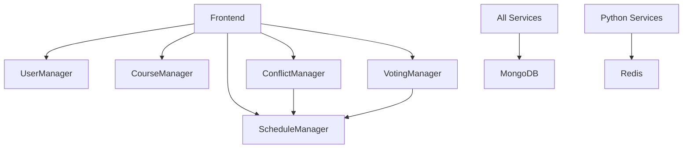

# Academic Scheduler - Microservices Architecture

## Overview
Academic Scheduler is a microservices-based application for managing academic schedules, courses, conflicts, and voting. The system is designed with scalability, maintainability, and monitoring in mind.

## Architecture Components

### Microservices

#### 1. **User Manager** (Java/Spring Boot)
- **Port**: 8082
- **Technology**: Spring Boot 3.4.5, Java 17, MongoDB
- **Responsibilities**: User authentication, authorization, and profile management
- **Health Check**: `http://usermanager:8082/actuator/health`
- **Metrics**: `http://usermanager:8082/actuator/prometheus`

#### 2. **Course Manager** (Java/Spring Boot)
- **Port**: 8082
- **Technology**: Spring Boot 3.1.8, Java 8, MongoDB
- **Responsibilities**: Course CRUD operations, course scheduling
- **Health Check**: `http://coursemanager:8082/actuator/health`
- **Metrics**: `http://coursemanager:8082/actuator/prometheus`

#### 3. **Schedule Manager** (Java/Spring Boot)
- **Port**: 8083
- **Technology**: Spring Boot 3.1.8, Java 8, MongoDB
- **Responsibilities**: Schedule creation, management, and optimization
- **Health Check**: `http://schedulemanager:8083/actuator/health`
- **Metrics**: `http://schedulemanager:8083/actuator/prometheus`

#### 4. **Conflict Manager** (Python/Flask)
- **Port**: 5000
- **Technology**: Flask 3.0.2, Python, MongoDB, Google Gemini AI
- **Responsibilities**: Conflict detection using AI, schedule optimization
- **Health Check**: `http://conflictmanager:5000/health`
- **Key Libraries**: NetworkX, OR-Tools, Gemini AI

#### 5. **Schedule Voting Manager** (Python/Flask)
- **Port**: 5000
- **Technology**: Flask 3.0.2, Python, MongoDB
- **Responsibilities**: Voting mechanism for schedule preferences
- **Health Check**: `http://schedulevotingmanager:5000/health`

#### 6. **Frontend** (React/TypeScript)
- **Port**: 5173
- **Technology**: React 19, Vite, TypeScript, Chakra UI
- **Responsibilities**: User interface and client-side logic

### Infrastructure Services

#### 7. **API Gateway** (Nginx)
- **Port**: 80 (HTTP), 443 (HTTPS)
- **Responsibilities**: 
  - Centralized entry point for all services
  - Load balancing
  - CORS handling
  - Rate limiting
  - SSL termination
- **Routes**:
  - `/` → Frontend
  - `/api/users` → User Manager
  - `/api/courses` → Course Manager
  - `/api/schedules` → Schedule Manager
  - `/api/conflicts` → Conflict Manager
  - `/api/voting` → Schedule Voting Manager
  - `/monitoring` → Grafana Dashboard
  - `/prometheus` → Prometheus Metrics

#### 8. **Redis**
- **Port**: 6379
- **Responsibilities**: Shared cache and session storage
- **Technology**: Redis Alpine

#### 9. **Prometheus**
- **Port**: 9090
- **Responsibilities**: Metrics collection and time-series database
- **Scraping Interval**: 15 seconds
- **Data Retention**: Configurable (default: 15 days)

#### 10. **Grafana**
- **Port**: 3000
- **Responsibilities**: Monitoring dashboards and visualization
- **Default Credentials**: admin/admin
- **Pre-configured**: Prometheus datasource

#### 11. **SonarQube**
- **Port**: 9000
- **Responsibilities**: Code quality and security analysis
- **Database**: PostgreSQL 13

## Network Architecture

```
                    ┌─────────────────┐
                    │   API Gateway   │
                    │  (Nginx: 80)    │
                    └────────┬────────┘
                             │
           ┌─────────────────┼─────────────────┐
           │                 │                 │
    ┌──────▼──────┐   ┌─────▼─────┐   ┌──────▼──────┐
    │  Frontend   │   │  Java     │   │  Python     │
    │  (React)    │   │ Services  │   │  Services   │
    └─────────────┘   └─────┬─────┘   └──────┬──────┘
                            │                 │
                    ┌───────┴─────────────────┴───────┐
                    │                                 │
            ┌───────▼────────┐            ┌──────────▼──────┐
            │    MongoDB     │            │      Redis      │
            │   (External)   │            │    (Cache)      │
            └────────────────┘            └─────────────────┘
                                                  │
                                          ┌───────▼───────┐
                                          │  Prometheus   │
                                          │  (Metrics)    │
                                          └───────┬───────┘
                                                  │
                                          ┌───────▼───────┐
                                          │   Grafana     │
                                          │ (Dashboard)   │
                                          └───────────────┘
```

## Getting Started

### Prerequisites
- Docker & Docker Compose
- 8GB RAM minimum
- 20GB free disk space

### Running the System

1. **Clone the repository**:
   ```bash
   cd /Users/ravinbandara/Desktop/Ravin/Academic_Scheduler
   ```

2. **Start all services**:
   ```bash
   cd deployments
   docker-compose up -d
   ```

3. **Check service health**:
   ```bash
   docker-compose ps
   ```

4. **View logs**:
   ```bash
   docker-compose logs -f [service-name]
   ```

5. **Stop all services**:
   ```bash
   docker-compose down
   ```

### Access Points

| Service | URL | Description |
|---------|-----|-------------|
| Frontend | http://localhost | Main application UI |
| API Gateway | http://localhost/health | Gateway health check |
| Grafana | http://localhost:3000 | Monitoring dashboard |
| Prometheus | http://localhost:9090 | Metrics (internal) |
| SonarQube | http://localhost:9000 | Code quality |

### API Endpoints

All APIs are accessible through the API Gateway:

#### User Management
- `GET /api/users` - List users
- `POST /api/users` - Create user
- `GET /api/users/{id}` - Get user details
- `PUT /api/users/{id}` - Update user
- `DELETE /api/users/{id}` - Delete user

#### Course Management
- `GET /api/courses` - List courses
- `POST /api/courses` - Create course
- `GET /api/courses/{id}` - Get course details
- `PUT /api/courses/{id}` - Update course
- `DELETE /api/courses/{id}` - Delete course

#### Schedule Management
- `GET /api/schedules` - List schedules
- `POST /api/schedules` - Create schedule
- `GET /api/schedules/{id}` - Get schedule details
- `PUT /api/schedules/{id}` - Update schedule
- `DELETE /api/schedules/{id}` - Delete schedule

#### Conflict Detection
- `POST /api/conflicts` - Detect conflicts
- `GET /api/conflicts` - Get optimal schedules

#### Schedule Voting
- `POST /api/voting` - Submit vote
- `GET /api/voting` - Get voting results

## Monitoring & Observability

### Health Checks
All services implement health check endpoints:
- **Java Services**: `/actuator/health`
- **Python Services**: `/health`
- **API Gateway**: `/health`

### Metrics
Prometheus collects metrics from all services:
- **Java Services**: Spring Boot Actuator + Micrometer
- **Python Services**: Custom metrics (can be enhanced)
- **Infrastructure**: Redis, Nginx metrics

### Dashboards
Access Grafana at http://localhost:3000 to view:
- Service health status
- Request rates and latency
- Error rates
- Resource utilization (CPU, Memory)
- Custom business metrics

## Development

### Adding a New Microservice

1. Create service directory in `source/`
2. Add Dockerfile
3. Update `docker-compose.yml`:
   ```yaml
   newservice:
     build:
       context: ../source/newservice
     networks:
       - microservices-network
     healthcheck:
       test: ["CMD", "curl", "-f", "http://localhost:PORT/health"]
   ```
4. Add route to API Gateway (`nginx/api-gateway.conf`)
5. Add Prometheus scraping config (`monitoring/prometheus.yml`)

### Service Dependencies



## Configuration

### Environment Variables
Each service can be configured via environment variables in `docker-compose.yml` or `.env` files.

### Secrets Management
- MongoDB credentials are in environment variables (should be moved to secrets management)
- Consider using Docker Secrets or Kubernetes Secrets in production

## Testing

### Unit Tests
```bash
# Java services
cd source/usermanager
./mvnw test

# Python services
cd source/conflictmanager
pytest
```

### Integration Tests
```bash
# Run all services
cd deployments
docker-compose up -d

# Run integration tests
./run-integration-tests.sh
```

### Load Testing
Use the API Gateway endpoint for load testing:
```bash
ab -n 1000 -c 10 http://localhost/api/users
```

## Security

### Current Implementation
- CORS configured per service
- API Gateway handles security headers
- MongoDB connection uses SSL/TLS

### Recommendations for Production
1. Enable HTTPS (SSL/TLS) on API Gateway
2. Implement JWT authentication
3. Add rate limiting per user/IP
4. Use secrets management (HashiCorp Vault, AWS Secrets Manager)
5. Enable network policies in Kubernetes
6. Regular security scanning with OWASP tools

## Deployment

### Docker Compose (Development)
```bash
cd deployments
docker-compose up -d
```

### Kubernetes (Production)
K8s manifests are available in `deployments/k8s/`:
```bash
kubectl apply -f deployments/k8s/
```

### CI/CD
- ArgoCD configuration: `deployments/k8s/argocd-app.yaml`
- GitHub Actions workflows can be added for automated builds

## Troubleshooting

### Common Issues

1. **Service won't start**
   ```bash
   docker-compose logs [service-name]
   ```

2. **MongoDB connection failed**
   - Check MongoDB URI in environment variables
   - Ensure network connectivity

3. **Gateway returns 502**
   - Check if backend service is healthy
   - Verify service name resolution

4. **High memory usage**
   - Adjust JVM heap sizes for Java services
   - Configure resource limits in docker-compose.yml

## Performance Tuning

### Java Services
- Adjust JVM parameters in Dockerfile:
  ```dockerfile
  ENV JAVA_OPTS="-Xmx512m -Xms256m"
  ```

### Python Services
- Configure gunicorn workers in `gunicorn.conf.py`
- Enable Redis caching for frequently accessed data

### Database
- Add indexes for common queries
- Consider read replicas for high read loads

## Contributing

1. Fork the repository
2. Create feature branch
3. Commit changes
4. Push to branch
5. Create Pull Request

## License

[Your License Here]

## Team

- @ravin00
- @Venath
- @Kesh02
- @VikumChathuranga22434
